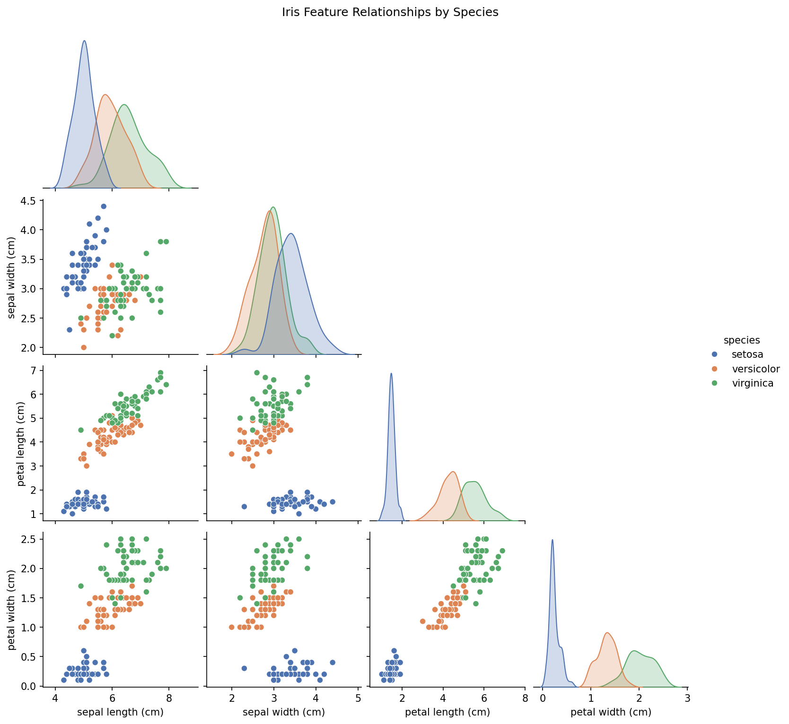
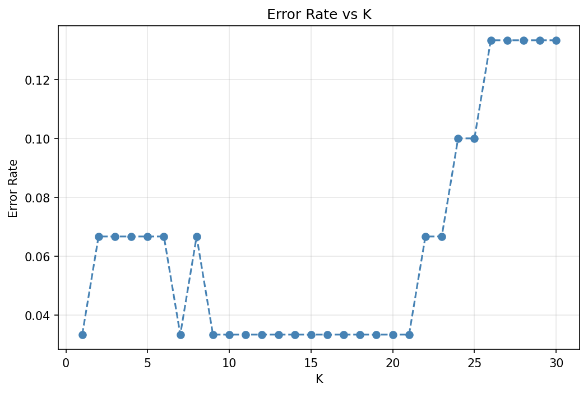
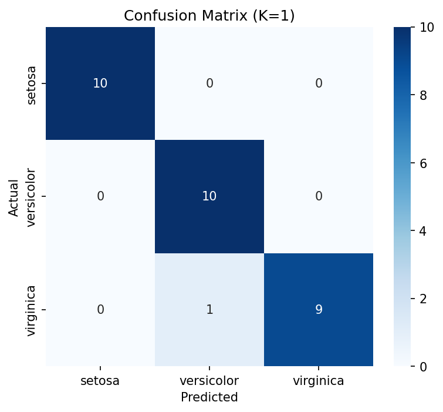

# Iris Classification with K-Nearest Neighbors

A complete supervised learning pipeline built on the classic Iris dataset:
load, scale, split, train, tune, and evaluate.

## Overview

| | |
|---|---|
| **Dataset** | Iris (150 samples, 4 features, 3 balanced classes) |
| **Algorithm** | K-Nearest Neighbors (KNN) |
| **Preprocessing** | StandardScaler (fit on train only) |
| **Split** | 80/20, stratified, shuffled |
| **K selection** | Elbow method (error rate vs. K, swept 1–30) |
| **Evaluation** | Accuracy, macro F1, confusion matrix, per-class precision/recall |

## Why this isn't just "load data, call .fit()"

- **No data leakage**: the scaler is fit only on the training set, then
  applied to the test set — fitting on the full dataset before splitting
  would leak test-set statistics into training.
- **K isn't guessed**: K is tuned by sweeping 1–30 and picking the elbow
  point in the error-rate curve, rather than defaulting to `n_neighbors=5`.
- **Accuracy alone isn't trusted**: results are backed by a full confusion
  matrix and macro F1, since accuracy can be misleading even on a
  balanced dataset like Iris.
- **Generalization check**: the model is tested on a synthetic sample
  outside the original 150 rows, not just the held-out test split.

## Exploratory Data Analysis

Pairwise feature relationships across the three species:



## Choosing K

Error rate swept across K = 1 to 30, with the elbow marking the optimal value:



## Results

- Accuracy: ~0.97–1.00 (exact value depends on random seed / split)
- Macro F1: ~0.97–1.00
- Best K: found via elbow method (typically 3–7 for this dataset)
- Confusion matrix: near-perfect separation of Setosa; occasional overlap
  between Versicolor and Virginica, which is expected — their petal
  measurements are naturally close.



## Project structure

```
Iris-Classification-KNN/
├── iris_knn.py              # Main script — full pipeline, cell-marked (# %%)
├── notebooks/
│   └── iris_knn.ipynb       # Same pipeline, notebook format
├── outputs/                 # Generated plots
├── requirements.txt
└── README.md
```

## How to run

```bash
git clone https://github.com/AbdullahAhmed04/Iris-Classification-KNN.git
cd Iris-Classification-KNN
pip install -r requirements.txt
python iris_knn.py
```

Or open `notebooks/iris_knn.ipynb` in Jupyter/Kaggle/Colab and run all cells.

## Pipeline (IPO framework)

1. **Input** — Load Iris via `sklearn.datasets`, inspect shape/class balance/stats
2. **Process** — Stratified train-test split → StandardScaler → KNN, K tuned via elbow method
3. **Output** — Accuracy, macro F1, classification report, confusion matrix heatmap

## Tech stack

- Python 3, scikit-learn, pandas, numpy, matplotlib, seaborn
